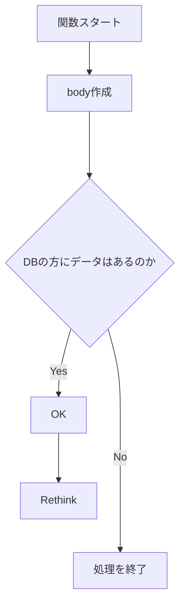

# 基本要件定義

- 例）ログイン機能はほしい
-

# 追加要件

-
-

# 将来的な追加要件

```mermaid
flowchart TD
  A[関数スタート] --> R[body作成]
  R --->B{"DBの方にデータはあるのか"}
  B -->|Yes| C[OK]
  C --> D[Rethink]
  B ---->|No| E[処理を終了]

```

-
-
